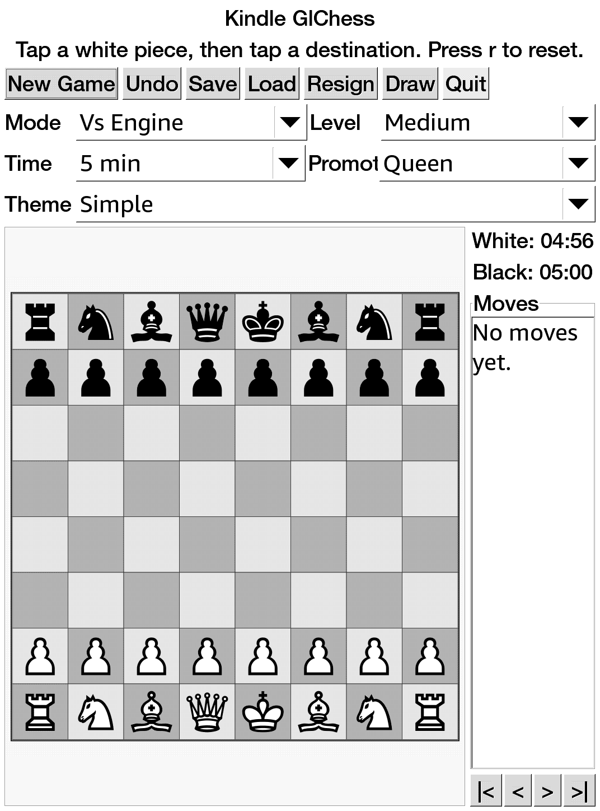

# Kindle GlChess

A Kindle-friendly chess app derived from GNOME Chess rules and assets.



Kindle GlChess is an unofficial Kindle-focused derivative of GNOME Chess /
GNOME Games. It keeps GNOME Chess/glchess move rules and artwork, while
replacing the original GNOME desktop application shell with a small GTK2/Cairo
interface packaged for jailbroken Kindle devices.

This project is also informed by the GnomeGames4Kindle porting work. Original
GNOME Chess code and artwork remain credited to the GNOME Games authors;
Kindle porting groundwork and packaging references are credited to
GnomeGames4Kindle and its author(s).

## Features

- Touch-friendly GTK2 interface sized for Kindle screens.
- Cairo-rendered board with GNOME Chess simple/fancy SVG piece themes.
- GNOME Chess/glchess-derived legal move validation, check, checkmate, castling,
  en passant, promotion, SAN-style move history, undo, save, and load.
- One-player mode through an optional UCI engine, usually Stockfish.
- Two-player local mode.
- KUAL extension packaging with bundled ARM runtime libraries.

## Quick Install

Use the prebuilt extension package:

```text
release/kindle-glchess-extension.zip
```

Unzip it at the Kindle USB-storage root so it creates:

```text
/mnt/us/extensions/kindle-chess
/mnt/us/documents/shortcut_kindleglchess.sh
```

Then launch from KUAL:

```text
KUAL -> Kindle GlChess -> Launch
```

The document shortcut is optional. KUAL is the reliable launch path; a stock
Kindle home screen normally will not execute `.sh` files unless another script
launcher/file association is installed.

## Kindle Prerequisites

This is native Kindle homebrew. You need:

- A jailbroken Kindle.
- KUAL installed.
- MRPI installed if your jailbreak/KUAL setup uses MRPI for package installs.
- USB access to copy this extension to `/mnt/us`.

Useful current references:

- Kindle Modding Wiki, jailbreak overview: https://kindlemodding.org/jailbreaking/
- Kindle Modding Wiki, KUAL and MRPI setup: https://kindlemodding.org/jailbreaking/post-jailbreak/installing-kual-mrpi/
- MobileRead KUAL thread: https://www.mobileread.com/forums/showthread.php?t=203326
- MobileRead MRPI wiki: https://wiki.mobileread.com/wiki/MobileRead_Package_Installer
- MobileRead Kindle 5.x jailbreak notes: https://wiki.mobileread.com/wiki/5_x_Jailbreak

Kindle jailbreak compatibility depends on model and firmware. Follow the
current guide for your exact device; do not assume a jailbreak method applies
just because another Kindle model works.

## Build

The supported build path is Docker cross/foreign-architecture build using an
ARMv7 Debian Bullseye container:

```bash
./docker_rebuild.sh
```

That command:

- Builds or starts the persistent `kindle-glchess-armhf-builder` container.
- Compiles the ARM hard-float `kindle-chess` binary.
- Runs `smoke-test`.
- Packages `dist/kindle-glchess-extension.zip`.

If your Linux Docker install cannot run ARM containers, install binfmt support:

```bash
docker run --privileged --rm tonistiigi/binfmt --install arm
```

See [docs/BUILDING.md](docs/BUILDING.md) for the full build process.

## Release Artifact

The checked-in release artifact is:

```text
release/kindle-glchess-extension.zip
```

Verify it with:

```bash
cd release
sha256sum -c SHA256SUMS
```

## License And Provenance

Kindle GlChess is not an official GNOME project or an official
GnomeGames4Kindle release. It is a derivative project that includes code and
assets from GNOME Games / GNOME Chess and keeps the applicable GPL-family
license texts in `licenses/`.

Runtime libraries bundled in the release zip keep their own upstream licenses;
the generated package includes `LICENSES/RUNTIME-LIBS.txt` and
`LICENSES/THIRD-PARTY-NOTICE.txt`.

See [docs/PROVENANCE.md](docs/PROVENANCE.md).
